# Maven 项目管理工具

# 1.Maven基础

### 1.1 Maven介绍

#### 1.1.1 什么是Maven

​	Maven是一个跨平台的项目管理工具，将项目开发和管理过程抽象成一个项目对象模型（POM）。作为Apache组织的一个颇为成功的开源项目，其主要服务于基于Java平台的项目创建，依赖管理和项目信息管理。maven是Apache的顶级项目，解释为“专家，内行”，它是一个项目管理的工具，maven自身是纯java开发的，可以使用maven对java项目进行构建、依赖管理。


#### 1.1.2 Maven的作用

- 依赖管理
  - 依赖指的就是是 我们项目中需要使用的第三方Jar包, 一个大一点的工程往往需要几十上百个Jar包,按照我们之前的方式,每使用一种Jar,就需要导入到工程中,还要解决各种Jar冲突的问题.
  - Maven可以对Jar包进行统一的管理,包括快速引入Jar包,以及对使用的 Jar包进行统一的版本控制
- 一键构建项目
  - 之前我们创建项目,需要确定项目的目录结构,比如`src` 存放Java源码, `resources`存放配置文件,还要配置环境比如JDK的版本等等,如果有多个项目 那么就需要每次自己搞一套配置,十分麻烦
  - Maven为我们提供了一个标准化的Java项目结构,我们可以通过Maven快速创建一个标准的Java项目.

### 1.2 Maven 的使用

#### 1.2.1 Maven软件的下载

使用 Maven 管理工具，我们首先要到官网去下载它的安装软件。

<http://maven.apache.org/download.cgi> 

目前最新版是 apache-maven-3.6.3 版本，在我们的软件文件夹中已经下载好了.

#### 1.2.2 Maven软件的安装

Maven 下载后，将 Maven 解压到一个没有中文没有空格的路径下，比如:H:\software\maven 下面。 解压后目录结构如下： 

1. bin:存放了 maven 的命令  核心运行文件
2. boot:存放了一些 maven 本身的引导程序，如类加载器等
3. conf:存放了 maven 的一些配置文件，如 setting.xml 文件 
4. lib:存放了 maven 本身运行所需的一些 jar 包 

#### 1.2.3 Maven环境变量配置

1) 配置 MAVEN_HOME ，变量值就是你的 maven 安装的路径（bin 目录之前一级目录） 

2) 将MAVEN_HOME 添加到Path系统变量

#### 1.2.4 Maven 软件版本测试 

通过 mvn -v命令检查 maven 是否安装成功，看到 maven 的版本为 3.6.3 及 java 版本为 jdk-11 即为安装 成功。 打开命令行，输入 mvn –v命令，如下图： 


### 1.3 Maven 仓库

- Maven中的仓库是用来存放maven构建的项目和各种依赖的(Jar包)。 

#### 1.3.1 Maven的仓库分类

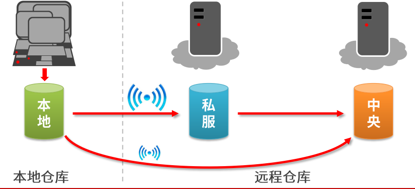

**本地仓库**:    位于自己计算机中的仓库, 用来存储从远程仓库或中央仓库下载的插件和 jar 包，

**远程仓库**:    需要联网才可以使用的仓库，阿里提供了一个免费的maven 远程仓库。

**中央仓库**:    在 maven 软件中内置一个远程仓库地址 http://repo1.maven.org/maven2 ，它是中 央仓库，服务于整个互联网，它是由 Maven 团队自己维护，里面存储了非常全的 jar 包，它包 含了世界上大部分流行的开源项目构件

**私服**：部门/公司范围内存储资源的仓库，从中央仓库获取资源。

私服的作用：

1. 保存具有版权的资源，包含购买或自主研发的jar
2. 中央仓库中的jar都是幵源的，不能存储具有版权的资源
3. —定范围内共享资源，仅对内部幵放，不对外共享

#### 1.3.2 Maven 本地仓库的配置 

1) maven仓库默认是在 C盘  .m2 目录下,我们不要将仓库放在C盘,所以这里同学们要重新配置一下.

2) 为了方便同学们的使用，老师为大家提供了一个本地仓库，将 “repository.rar”解压至自己的 电脑上，我解压在 D:\software\repository 目录下（注意最好放在没有中文及空格的目录下）。 

2) 在maven安装目录中,进入 conf文件夹,  可以看到一个 settings.xml 文件中, 我们在这个文件中, 进行本地仓库的配置

3) 打开 settings.xml文件，进行如下配置如下： 

```xml
  <localRepository>D:\software\repository</localRepository>
```

#### 1.3.3 配置阿里云远程仓库

Maven默认的远程仓库是在国外, 所以下载jar包时速度会非常慢, 这里推荐大家使用我大天朝的阿里云仓库

1) 打开 settings.xml,找到 <mirrors> 标签 , 下面的内容复制到  <mirrors> 中 即可

```xml
<mirror>
    <id>alimaven</id>
    <name>aliyun maven</name>
    <url>
        http://maven.aliyun.com/nexus/content/groups/public/
    </url>
    <mirrorOf>central</mirrorOf>        
</mirror>
```

### 1.4创建Maven项目

#### 1.4.1 IDEA中配置Maven

1) 打开IDEA 创建一个新的project

2) 起名为web_work

3) 首先打开IDEA 选择File --> Settings  --> 搜素maven,就会看到如下界面


4) 修改默认配置配置

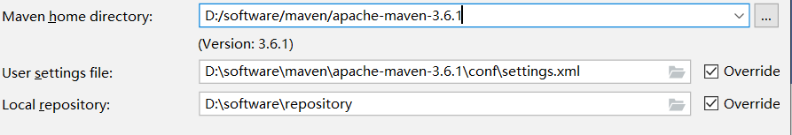

#### 1.4.2 创建Maven工程

**在IDEA中配置好maven后, 接下来我们使用maven去快速的去构建一个 JavaWeb项目**

1) project创建好以后, 选择创建module

2) 选中创建一个 maven 工程

3) 点击 Next填写项目信息 ，进行一下修改

4) 创建好的工程,长这个样子


Maven目录说明: 

```
src/main/java 		 —— 存放项目的.java 文件 
src/main/resources 	 —— 存放项目资源文件，如数据库的配置文件 
src/test/java 		—— 存放所有单元测试.java 文件，如 JUnit 测试类 
target 			    —— 项目输出位置，编译后的class 文件会输出到此目录 
pom.xml              ——maven 项目核心配置文件
```

Tomcat7运行插件

```xml
<build>
  <plugins>
   <plugin>
        <groupId>org.apache.tomcat.maven</groupId> 
        <artifactId>tomcat7-maven-plugin</artifactId>
        <version>2.1</version>
   <configuration>
        <port>80</port>
        <path>/</path>
   </configuration>
   </plugin>
  </plugins>
<build>
```

添加此插件后会在maven的插件中多出一个：


#### 1.4.3Maven的常用命令

1) 一个maven项目生命周期

​	使用 maven 完成项目的构建，项目构建包括：清理、编译、测试、部署等过程，maven 将这些 过程规范为一个生命周期，

maven 通过执行一些简单命令即可实现上边生命周期的各个过程

| 命令            | 说明                                                         |
| --------------- | ------------------------------------------------------------ |
| **mvn compile** | 完成编译操作 , 执行完毕后，会生成target目录，该目录中存放了编译后的字节码文件。 |
| **mvn clean**   | 执行完毕后，会将target目录删除.                              |
| **mvn test**    | 执行完毕后，会在target目录中生成三个文件夹：<br />surefire、surefire-reports（测试报告）、test-classes（测试的字节码文件） |
| **mvn package** | 完成打包操作, 执行完毕后，会在target目录中生成一个文件，该文件可能是 jar、war |
| **mvn install** | 执行 mvn install命令，完成将打好的jar包安装到本地仓库的操作 ,<br /> 执行完毕后，会在本地仓库中出现安装后的jar包，方便其他工程引用 |

#### 1.4.4工具栏介绍


```
1.根据pom.xml文件重新导入所有Maven项目和依赖,刷新
2.创建源码（重新编译）并更新目录
3.下载源码或文档
4.添加Maven项目
5.执行生命周期中的阶段，选中lifecycle选项中生命周期中的一个阶段（phase），才能点击执行。
6.运行Maven生命周期或插件
7.切换离线模式，就是关闭和远程仓库的链接，从本地仓库中获取，也不能将jar包提交到远程仓库
8.是否跳过测试，点击选中就可以跳过测试，在点击选择取消跳过测试
9.展示当前选中的maven项目jar包的依赖，并且可以直接在图形化依赖图上进行排除依赖操作
10.收起下面展开的视图
11.跳转到maven的Setting页面
```

### 1.5依赖管理

#### 1.5.1依赖的配置

- 依赖指当前项目运行所需的jar,一个项目可以设置多个依赖

- 格式：

  ```xml
  -   <dependencies>
            <dependency>
                <groupId>javax.servlet</groupId>
                <artifactId>servlet-api</artifactId>
                <version>3.1.0</version>
            </dependency>
        </dependencies>
  ```

  一个Maven工程就是由`groupId`，`artifactId `和 `version` 作为唯一标识, 我们在引用其他第三方库的时候，也是通过这3个变量确定。

  - 坐标的概念
    - 在maven中坐标就是为了定位一个唯一确定的jar包。
    - maven世界拥有大量构建，我们需要找一个用来唯一标识一个构建的统一规范，拥有了统一规范，就可以把查找工作交给机器

  - Maven坐标主要组成(GAV) - 确定一个jar在互联网位置 

  | 标签           | 含义                                                         |
  | -------------- | ------------------------------------------------------------ |
  | **groupId**    | 定义当前Maven组织名称,通常是公司名                           |
  | **artifactId** | 定义实际项目名称                                             |
  | **version**    | 定义当前项目的当前版本                                       |
  | **packaging**  | 打包类型<br />jar：执行 package 会打成 jar 包       war：执行 package 会打成 war 包 |
  | **dependency** | 使用 `<dependency> `声明一个依赖后，Maven就会自动下载这个依赖包 |

  4)  maven 的依赖管理, 是对项目所依赖的 jar 包进行统一管理。 

  | 标签             | 含义                                                         |
  | ---------------- | ------------------------------------------------------------ |
  | **dependencies** | 表示依赖关系                                                 |
  | **dependency**   | 使用 `<dependency> `声明一个依赖后，Maven就会自动下载这个依赖包 |

  5) 坐标的来源方式 

  添加依赖需要指定依赖 jar 包的坐标，但是很多情况我们是不知道 jar 包的的坐标，可以通过如下方 式查询： 
  从网站中搜索即可

  5.1) 输入网址,进入网址 , 进行查询

  ```http
  https://mvnrepository.com/
  ```

  5.2)  点击进入后,可以看到主页面

  

  

5.3）通过查询来获取相应的坐标

例如：


#### 1.5.2依赖传递

依赖具有传递性

- 直接依赖：在当前项目中通过依赖配置建立的依赖关系
-  间接依赖：被资源的资源如果依赖其他资源，当前项目间接依赖其他资源

依赖的冲突问题：

路径优先：当依赖中出现相同的资源时，层级越深，优先级越低，层级越浅，优先级越高

声明优先：当资源在相同层级被依赖时，配置顺序靠前的覆盖配置顺序靠后的

特殊优先：当同级配置了相同资源的不同版本，后配置的覆盖先配置的(也就是一个工程的Pom.xml中，同时配置了相同的依赖但版本不同）

#### 1.5.2可选依赖

可选依赖指对外隐藏当前所依赖的资源一一不透明    使用<optional>

```xml
<dependency>
<groupId>junit</groupId>
<artifactId>junit</artifactId>
<version>4.12</version>
<optional>true</optional>
</dependency>
```

#### 1.5.3排除依赖

排除依赖指主动断开依赖的资源，被排除的资源无需指定版本一一不需要   使用 <exclusion>

```xml
<dependency>
<groupId>junit</groupId>
<artifactId>junit</artifactId> <version>4.12</version>
<exclusions>
<exclusion>
<groupId>org.hamcrest</groupId>
<artifactId>hamcrest-core</artifactId>
</exclusion>
</exclusions>
</dependency>
```

#### 1.5.4依赖范围

A 依赖 B，需要在 A 的 pom.xml 文件中添加 B 的坐标，添加坐标时需要指定依赖范围，依赖范围包括：

| 依赖范围 | 说明                                                         |
| -------- | ------------------------------------------------------------ |
| compile  | 编译范围，指 A在编译时依赖 B，此范围为默认依赖范围。编译范围的依赖会用在 编译、测试、运行，由于运行时需要所以编译范围的依赖会被打包。 |
| provided | provided 依赖只有在当 JDK 或者一个容器已提供该依赖之后才使用， provided 依 赖在编译和测试时需要，在运行时不需要，比如：servlet api 被 tomcat 容器提供。 |
| runtime  | runtime 依赖在运行和测试系统的时候需要，但在编译的时候不需要。比如：jdbc 的驱动包。由于运行时需要所以 runtime 范围的依赖会被打包。 |
| test     | test 范围依赖 在编译和运行时都不需要，它们只有在测试编译和测试运行阶段可用， 比如：junit。由于运行时不需要所以test范围依赖不会被打包。 |
| system   | system 范围依赖与 provided 类似，但是你必须显式的提供一个对于本地系统中 JAR 文件的路径，需要指定 systemPath 磁盘路径，system依赖不推荐使用。 |

可以通过scope标签设定其作用范围

 作用范围：

- 主程序范围有效（main文件夹范围内）

- 测试程序范围有效（test文件夹范围内）

-  是否参与打包（package指令范围内）

- 

  

  

  例如：

  ```xml
  <dependencies>
      <dependency>
          <groupId>junit</groupId>
          <artifactId>junit</artifactId>
          <version>4.13</version>
          <scope>compile</scope>
      </dependency>
  </dependencies>
  ```

### 1.6Maven的生命周期和插件

#### 1.6.1Maven的生命周期：


#### 1.6.2项目构建的生命周期：

​		Maven对项目构建的生命周期划分为3套

​				 clean：清理工作

​				 default：核心工作，例如编译，测试，打包，部署等

​				site：产生报告，发布站点


#### 1.6.3插件

插件：

- 插件与生命周期内的阶段绑定，在执行到对应生命周期时执行对应的插件功能
- 默认maven在各个生命周期上绑定有预设的功能
- 通过插件可以自定义其他功能
- 例如：

```xml
<build>
  <plugins>
   <plugin>
       /*打包源码插件*/
    <groupId>org.apache.maven.plugins</groupId> 
    <artifactId>maven-source-plugin</artifactId> 
    <version>2.2.1</version>
  <executions>   代表执行
   <execution>
    <goals>
     <goal>jar</goal>   jar是对源码进行打包     test-jar是对测试代码打包
    </goals>
<phase> generate-test-resources</phase>   执行的生命周期过程，也就是他要在哪个阶段执行
   </execution>
  </executions>
   </plugin>
  </plugins>
<build>
```

# 2.Maven的高级使用

## 2.1分模块的开发与设计

分模块开发

- 模块中仅包含当前模块对应的功能类与配置文件
- spring核心配置根据模块功能不同进行独立制作
- 当前模块所依赖的模块通过导入坐标的形式加入当前模块后才可以使用
-  web.xm［需要加载所有的spring核心配置文件
- 例如：

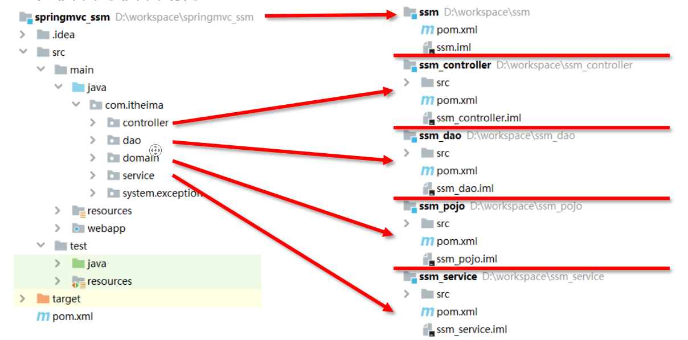

## 2.2聚合

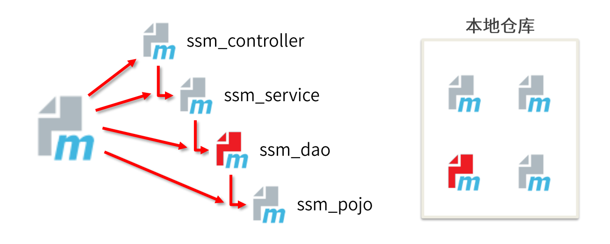

作用：聚合用于快速构建maven工程，一次性构建多个项目/模块。

制作方式：

♦创建一个空模块，打包类型定义为pom

```xml
<packaging>pom</packaging>
```

♦定义当前模块进行构建操作时关联的其他模块名称

```xml
<modules>
<module>../ssm_controller</module>
<module>../ssm_service</module>
<module>../s sm_dao</module>
<module>../ssm_poj o</module>
</modules>
```

注意事项：参与聚合操作的模块最终执行顺序与模块间的依赖关系有关，与配置顺序无关。

注意：

项目的默认打包方式是：jar包

web项目打包方式是war包

聚合用的是pom包

## 2.3继承

作用：通过继承可以实现在子工程中沿用父工程中的配置

- maven中的继承与java中的继承相似，在子工程中配置继承关系

- 制作方式：

- 在子工程中声明其父工程坐标与对应的位置

例如：

```xml
<parent>
<groupId>com.itheima</groupId> 
<artifactId>ssm</artifactId> 
<version>1.0-SNAPSHOT</version>
<! --填写父工程的po成件-->
<relativePath>../ssm/pom.xml</relativePath>
</parent>
```

```xml
在父工程中定义依赖管理
。--声明此处进行依赖管理-->
<dependencyManagement>
<!--具体的依赖-->
<dependencies>
一spring环境一〉
<dependency>
    <groupId>org.springframework</groupId> 
    <artifactId>spring-context</artifactId> 
    <version>5.1.9.RELEASE</version>
</dependency>
<dependencies>
<dependencyManagement>
```

在子工程中定义依赖关系，无需声明依赖版本，版本参照父工程中依赖的版本

```xml
<dependencies>
<!一spring环境一〉
<dependency>
<groupId>org.springframework</groupId> 
<artifactId>spring-context</artifactId>
</dependency>
</dependencies>
```

继承与聚合

- 作用:

用于快速构建项目

继承用于快速配置

- 相同点：

聚合与继承的pom.xmlX件打包方式均为pom,可以将两种关系制作到同一个pom文件中 

聚合与继承均属于设计型模块，并无实际的模块内容

- 不同点:

聚合是在当前模块中配置关系，聚合可以感知到参与聚合的模块有哪些 

继承是在子模块中配置 ，父模块无法感知哪些子模块继承了自己

- 注意：

  子工程中可以省略相关依赖的版本号。如果子工程定义了某个依赖的版本号，那么就不用父类的版本号了，就用自己的。

## 2.4属性

- 属性的类别：

1. 自定义属性

2. 内置属性

3. Setting属性

4. Java系统属性

5. 环境变量属性

- 作用：就是定义一个属性，方便以后的使用。

- 例如：

  定义一个属性

  ```xml
  <properties>
  <spring.version>5.1.9.RELEASE<spring.version> 
  <junit.version>4.12<junit.version>
  </properties>
  ```

  调用格式：

  ```xml
  <dependency>
  <groupId>org.springframework</groupId> 
  <artifactId>spring-context</artifactId> 
  <version>${spring.version}</version>
  </dependency>
  ```

  还有一些内置属性，例如：${version}等等。

## 2.5版本管理

- SNAPSHOT （快照版本）

项目幵发过程中，为方便团队成员合作，解决模块间相互依赖和时时更新的问题，幵发者对每 个模块进行构建的时候，输出的临时性版本叫快照版本（测试阶段版本）快照版本会随着幵发的进展不断更新。

- RELEASE （发布版本）

项目开发到进入阶段里程碑后，向团队外部发布较为稳定的版本，这种版本所对应的构件文件 是稳定的，即便进行功能的后续开发，也不会改变当前发布版本内容，这种版本称为发布版本。

- 工程版本号约定

约定规范：

1. v主版本＞.v次版本〉.v增量版本〉.v里程碑版本〉
2. 主版本：表示项目重大架构的变更，如：spring5相较于spring4的迭代
3. 次版本：表示有较大的功能增加和变化，或者全面系统地修复漏洞
4. 增量版本：表示有重大漏洞的修复
5. 里程碑版本：表明一个版本的里程碑（版本内部）。这样的版本同下一个正式版本相比，相对 来说不是很稳定，有待更多的测试

- 范例：

5.1.9.RELEASE

## 2.6资源配置

```xml
driver-class-name: com.mysql.cj.jdbc.Driver
url: jdbc:mysql://localhost:3306/mybatisplus_db
username: root
password: 123456
```

像这种配置文件，我们可以将其任一属性定义在pom.xml文件中

例如：将其YRL定义出来

```xml
<properties>
    <jdbc.url>jdbc:mysql://localhost:3306/mybatisplus_db</jdbc.url>
</properties>
```

通过${}的形式将其取出来：

```xml
spring:
  datasource:
    type: com.alibaba.druid.pool.DruidDataSource
    driver-class-name: com.mysql.cj.jdbc.Driver
    url: ${jdbc.url}
    username: root
    password: 123456
```

```xml
<build>
    <resources>
        <resource>
            <!--设定配置文件对应的位置目录，支持使用属性动态设定路径-->
            <directory>${project.basedir}/src/main/resources</directory>
            <!--开启对配置文件的加载过滤-->
            <filtering>true</filtering>
        </resource>
    </resources>
</build>
```

通过这些配置才可以使用，最后一步的配置一定要有。具体的原因我也不清楚。？？？？？？

## 2.7多环境开发配置

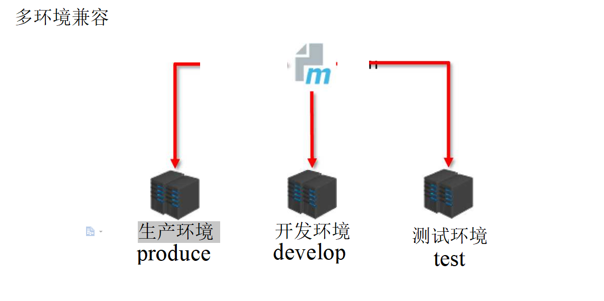

```xml
!--创建多环境--〉
<profiles >
    <profile>
    -定义具体的环境:生产环境
    〈profile〉
    <!--定义环境对应的唯一名称
    <id>pro_env</  >
    <!--定义环境中专用的属性值一>
    <properties>
    <jdbc.url>j dbc:mysql://127.1.1.1:330 6/s sm_db</j dbc.url> </prop >
    -设置默认启动一〉
    <activation>
    <activeByDefault>true</activeByDefault> </activation>
    </prof >
    -定义具体的环境:开发环境一>
    <profile>
    <id>dev env</id>
    </profile> 
</profiles>
```

## 2.8跳过测试(了解)

最简单的就是：


选中maven中的Test插件，点击此按钮

## 2.9私服

### 2.9.1基本概念

-  启动服务器（命令行启动）在bin目录下执行


nexus.exe /run nexus

访问服务器（默认端口： 8081）

http://localhost:8081

- 修改基础配置信息

​    安装路径下etc目录中nexus-default.properties文件保存有nexus基础配置信息，例如默认访问端口

- 修改服务器运行配置信息

  安装路径下bin目录中nexus.vmoptions文件保存有nexus服务器启动对应的配置信息，例如默认占用内存空间

- 私服资源的获取：

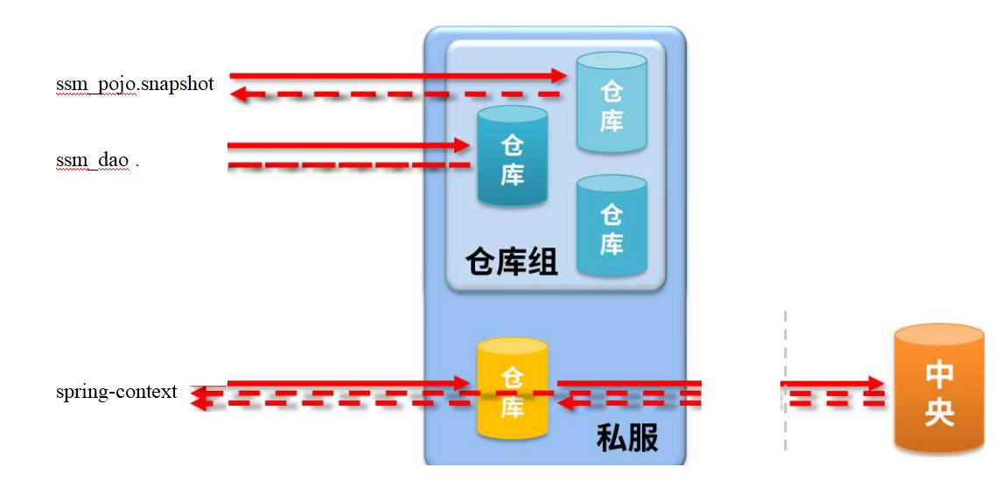

 

- ​     仓库的分类：

   宿主仓库hosted

​               ♦ 保存无法从中央仓库获取的资源

​                       ■ 自主研发

​                       ■ 第三方非开源项目

   代理仓库proxy

​              ♦ 代理远程仓库，通过nexus访问其他公共仓库，例如中央仓库 

  仓库组group

​              ♦将若干个仓库组成一个群组，简化配置

​              ♦ 仓库组不能保存资源，属于设计型仓库

 

### 2.9.2第三方使用nexus

 执行完命令以后，在浏览器访问localhot:8081，会弹出一个页面，进行登录。

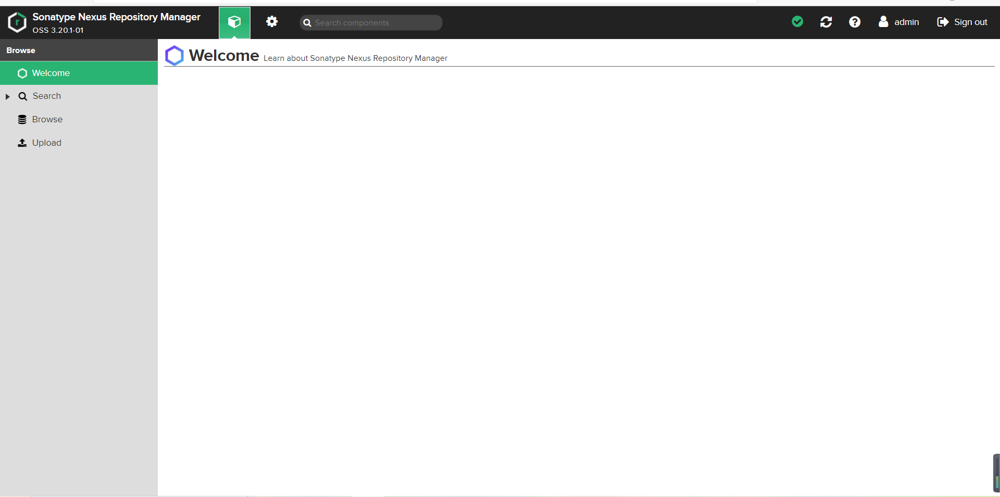

 

 

 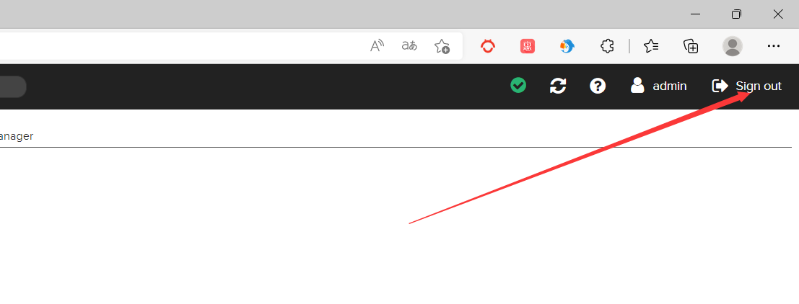

可以在设置库里创建仓库，将其添加到maven-plblic中。

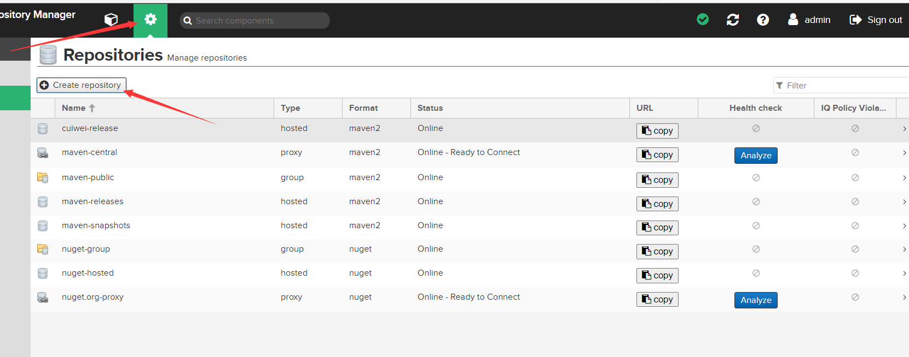


 在创建好的仓库中可以下载打包好的项目。

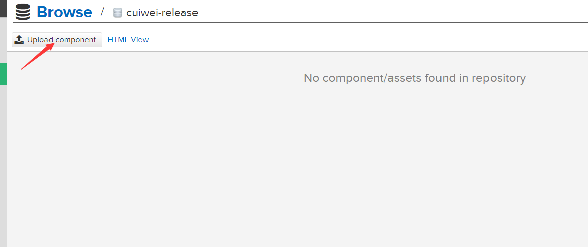

 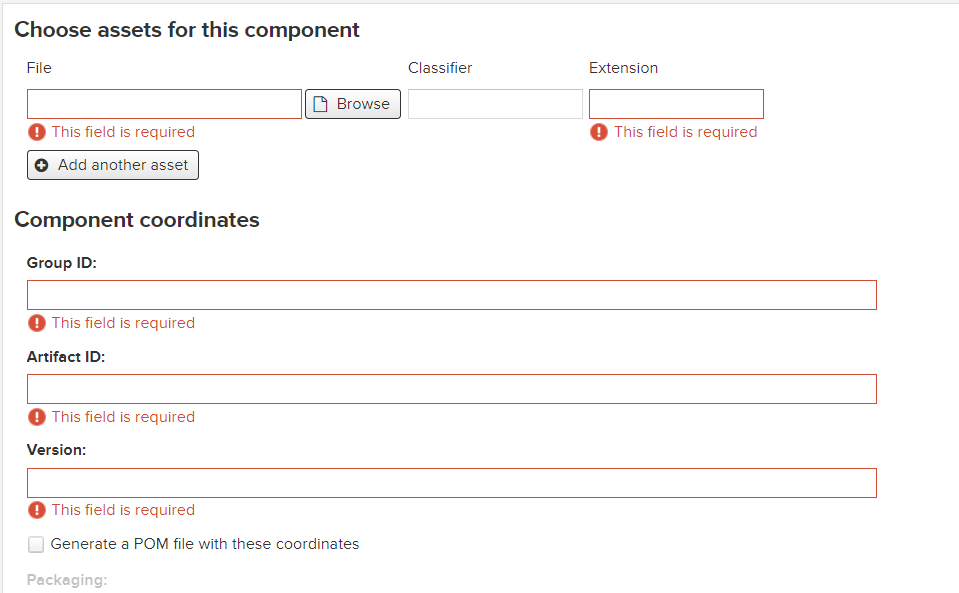

 

###  2.9.3  Idea访问私服

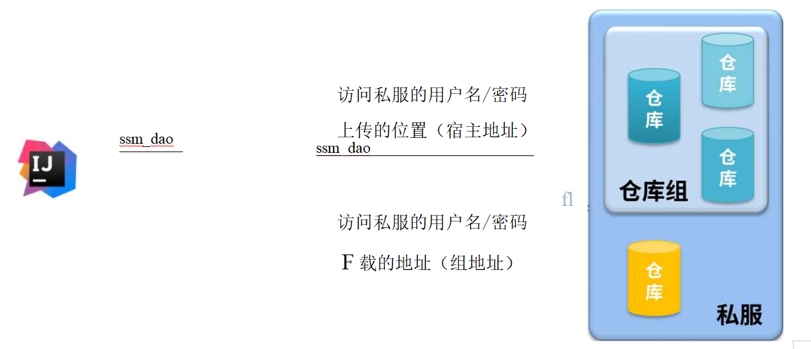

- 配置本地仓库访问私服的权限(setting.xml)

- 定义几个仓库配几个。

  ```xml
  <servers>
  <server>
  		 <id>cuiwei-release</id>
           <username>admin</username>
          <password>admin</password>
  </server>
  <server>
  		 <id>cuiwei-snapshots</id>
           <username>admin</username>
           <password>admin</password>
  </server>
  </servers>
  ```

- 配置本地仓库来源(自定义)

  ```xml
  <mirror>
      <id>nexus-cuiwei</id>
      <url>
     http://localhost:8081/repository/maven-public/
      </url>
      <mirrorOf>*</mirrorOf>        
  </mirror>
  ```

  在项目的pom.xml中配置：

  配置当前项目访问私服上传资源的位置

  ```xml
    
  <distributionManagement>
      <repository>
      <id>cuiwei-release</id>
      <url>http://localhost:8081/repository/cuiwei-release/</url>
  </repository>
      <snapshotRepository>
          <id>cuiwei-snapshots</id>
          <url>http://localhost:8081/repository/cuiwei-snapshots/</url>
      </snapshotRepository>
  </distributionManagement>
  ```

  注意：id要和配置文件（setting.xml中的相同）首先你的项目在发布的时候会根据url找到仓库，但是缺少用户名和密码，所以根据ID查找你的本地仓库配置中，找到你的用户名和密码

上传的指令  mvn deploy.